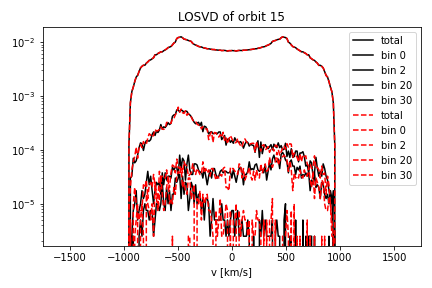
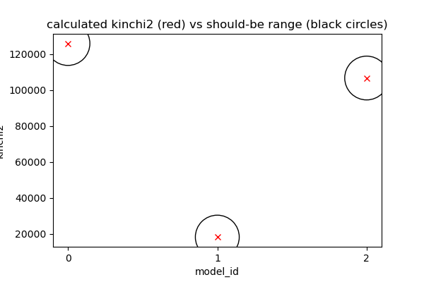

.. _installation:

******************
Installation guide
******************

.. _sys-requirements:

System requirements
===================

Computers running the DYNAMITE models must meet the following hardware requirements.

.. **Minimum Hardware Requirements**

.. * Processor:
.. * Processor speed:
.. * Random access memory (RAM):
.. * GPU
.. * Hard disk capacity:

**Recommended Hardware Requirements**

We recommend at least 50-100 GB of hard disk space for running the dynamical models.
The DYNAMITE software only takes 150 MB, but the orbit libraries can become very large. The table below shows some examples for model sizes of different orbit libraries (see the `configuration documentation <configuration.html#orblib-settings>`_ for more information on orbit library settings).
Note that the total memory requirements may be lower due to model sharing orbit libraries.

.. table::
   :widths: auto

   =====  =====  =====  ===========  =========  ================================================
     nE    nI2    nI3    dithering    Size       Example use
   =====  =====  =====  ===========  =========  ================================================
     5      4      3         1          71 MB    Good for tests (recommended minimum), too small for science
     6      5      4         1          79 MB    Used for test cases, too small for science
    21      8      7         1         213 MB
    21     10      7         5         461 MB    CALIFA and ATLAS3D
    41     11     11         1         733 MB
   =====  =====  =====  ===========  =========  ================================================

Usually, for one galaxy you will create at least 30 models to find the best-fitting model parameters.

.. _software-requirements:

Software requirements
=====================

Supplementary to this section, please also see the list of tested platforms as well as Fortran and Python releases at the `bottom of this document <#tested-platforms>`_.

Fortran compiler
----------------

The current version of DYNAMITE is based on routines which were written in Fortran. It is therefore necessary to have a pre-installed Fortran compiler. The best-suited Fortran compiler differs with different operation systems.

If you are using Linux, you will need ``ifort`` or ``gfortran`` (gcc/GNU Fortran).

If you are using macOS, you will need ``gfortran`` (gcc/GNU Fortran), which can be installed in a number of different ways.

We recommend a current version of the Fortran compiler. For ``gfortran``, ::

    gfortran --version

displays the version. We recommend version 10.4 or later.

macOS
^^^^^

In the following, we explain the installation of the GNU Fortran compiler via Homebrew and via MacPorts.

Homebrew
""""""""

**Homebrew** can be used to install the latest ``gcc`` and all additional libraries in the following way::

    brew update
    brew install gcc

``gcc`` should now be listed under your homebrew packages. You can check this by typing::

    brew list

We can check if ``gfortran`` is installed by typing in the Terminal::

    man -k fortran

with the output: ``gfortran(1) - GNU Fortran compiler`` (please ignore any lines starting with ``makewhatis:...``). The command ::

    which gfortran

returns its location, for example: ``/usr/local/bin/gfortran``.

MacPorts
""""""""

Alternatively, you can also install ``gcc`` with **MacPorts**. The installation is then a bit different::

    sudo port selfupdate
    sudo port upgrade outdated
    port search --name --line --glob 'gcc*'

lists the available ``gcc`` version. For example, having as the latest one ``gcc12``, install it with::

    sudo port install gcc12

In rare cases you may get an error complaining about failing to build/upgrade ``cctools`` In that case, clean and reinstall ``cctools`` by issuing the commands ``sudo port clean cctools`` and ``sudo port -v install cctools`` before trying to install ``gcc`` again. Finally, ::

    sudo port select --set gcc mp-gcc12

makes the newly installed ``gcc`` the default version (including ``gfortran``). ::

    which gfortran

returns its location, something like ``/opt/local/bin/gfortran``.

Python
------

The user is communicating with the Fortran source code via Python.
The basic requirement for DYNAMITE is therefore a reasonably current version of Python
(Python 3.9 or later as Python 3.8 has reached its end of life as of October 7, 2024).

.. Pre-Installation Checklist
.. --------------------------

Known problems
--------------

* Make sure that the compiler collection is installed with the proper libraries. If you get problems running Galahad or DYNAMITE, try to reinstall GCC and make sure that the Fortran compiler is included in your installation.

.. _install-procedure:

Installation and configure procedure
====================================

Download from `github <https://github.com/dynamics-of-stellar-systems/dynamite>`_, unzip and move the DYNAMITE code to the directory in which you want to install it. Make sure that your system fulfills the :ref:`software-requirements` listed above (in particular the Fortran compiler).

If you encouter problems during the installation process, have a look at the section :ref:`troubleshooting`. Some of the most common issues are gathered there.

There are two major installation options for DYNAMITE:

(A) DYNAMITE with the GALAHAD (the ``LegacyWeightSolver``) and the Python (SciPy and cvxopt) ``NNLS`` weight solvers.
(B) DYNAMITE with just the Python (SciPy and cvxopt) ``NNLS`` weight solvers.

In case of installation option (A), the installation of DYNAMITE consists of three steps; in case of (B), it consists of two steps, as detailed below.

1. Installation of GALAHAD
--------------------------

NOTE: this section (Installation of GALAHAD) only applies to DYNAMITE installation option (A).

GALAHAD is a "library of thread-safe Fortran 90 packages for large-scale nonlinear optimization". The DYNAMITE code comes with Version 2.3.  An updated version of GALAHAD could be obtained `here <http://www.galahad.rl.ac.uk/doc.html>`_ (last updated in 2018), but the most recent version seems to not work. The GALAHAD package included in DYNAMITE can be found in the folder ``.../legacy_fortran``.

For the installation go into the folder ``.../legacy_fortran/galahad-2.3/`` and type ::

    ./install_galahad

In the following installation, a number of prompts start. The answers differ for the different operation system and are shown in the following.

During the installation, your terminal might express several warnings. These are however not critical if your installation finishes properly.

Install Galahad, version 2.3 - prompt answers for Linux
^^^^^^^^^^^^^^^^^^^^^^^^^^^^^^^^^^^^^^^^^^^^^^^^^^^^^^^

Prompts from ``./install_galahad``. The answers for the recommended installation are marked in bold.

**Select platform**

1. Compaq (DEC) alpha
2. Cray
3. HP Workstation
4. IBM RS/6000
5. **PC <--**
6. ...

**Select operating system**

1. Windows 2000/XP with MinGW/Msys
2. **Linux <--**

**Select compiler**

1. NAG f90
2. NAG f95
3. Intel Itanium efc under linux (pc version)
4. Fujitsu frt under linux (pc version)
5. GNU g95 under linux (pc version)
6. **GNU gfortran under linux (pc version) <--**
7. **Intel ifort (previously ifc) under linux (pc version) <--**
8. Lahey lf95 under linux (pc version)
9. Portland Group pgf90 under linux (pc version)

(Note: pick either ``gfortran`` or ``ifort`` depending on what you installed above)

**Select subset of GALAHAD packages to be installed (the chosen subset will optionally be installed below)**

1. Everything
2. Everything for SIF/CUTEr
3. Everything for AMPL
4. LANCELOT B and its interface to SIF
5. LANCELOT B and its interface to AMPL
6. Just LANCELOT B
7. **The QP packages and their interfaces to CUTEr <--**
8. The QP packages and their interfaces to AMPL
9. Just the QP packages and their dependencies
10. FILTRANE and its interface to CUTEr
11. FILTRANE and its interface to AMPL
12. Just FILTRANE and its dependencies

**By default, the CUTEr you wish to use is installed in ... Is this OK?**

* y(es)
* **n(o) <--**

**Enter alternative directory for CUTEr:**

  | ``/home/.../dynamite/legacy_fortran/cuter`` (Note: Put your full directory path here)

**Do you now wish to compile the package subset you selected earlier?**

* **y(es) <--**
* n(o)

**The package subset may be installed in either single or double precision. Which precision do you require for the installed subset?**

* **D for double precision <--**
* S for single precision

**Do you also wish to install the single precision version?**

* y(es)
* **n(o) <--**

Install Galahad, version 2.3 - prompt answers for macOS
^^^^^^^^^^^^^^^^^^^^^^^^^^^^^^^^^^^^^^^^^^^^^^^^^^^^^^^
Prompts from ``./install_galahad``. The answers for the recommended installation are marked in bold.

**Select platform**

1. Compaq (DEC) alpha
2. Cray
3. HP Workstation
4. IBM RS/6000
5. PC
6. PC with ..
7. PC with
8. PC with
9. SGI workstation
10. SUN workstation
11. **MAC OS/X <--**

**Select compiler**

When using MacOS:

1. NAG f90
2. NAG f95
3. AbSoft f95
4. GNU g95 under OS/X
5. **GNU gfortran under OS/X <--**
6. Intel ifort (previously ifc) under Mac OsX

**Select subset of GALAHAD packages to be installed (the chosen subset will optionally be installed below)**

1. Everything
2. Everything for SIF/CUTEr
3. Everything for AMPL
4. LANCELOT B and its interface to SIF
5. LANCELOT B and its interface to AMPL
6. Just LANCELOT B
7. **The QP packages and their interfaces to CUTEr <--**
8. ...

**By default, the CUTEr you wish to use is installed in ... Is this OK?**

* y(es)
* **n(o) <--**

**Enter alternative directory for CUTEr:**

  | ``/Users/.../dynamite/legacy_fortran/cuter`` (Note: Put your full directory path here)

**Do you now wish to compile the package subset you selected earlier?**

* **y(es) <--**
* n(o)

**The package subset may be installed in either single or double precision. Which precision do you require for the installed subset?**

* **D for double precision <--**
* S for single precision

**Do you also wish to install the single precision version?**

* y(es)
* **n(o) <--**

Finalizing the installation of GALAHAD
^^^^^^^^^^^^^^^^^^^^^^^^^^^^^^^^^^^^^^

Set environment variables and path as prompted at the end of successful Galahad installation e.g. in your .bashrc or .zshrc file, depending on the shell you are using.

**Example: GALAHAD environment variables**

Output from GALAHAD::

    Remember to set the environment variable
     GALAHAD to /home/.../legacy_fortran/galahad-2.3
    In addition, please update your MANPATH to include
       /home/.../legacy_fortran/galahad-2.3/man
    and your PATH to include
       /home/.../legacy_fortran/galahad-2.3/bin

Update in .bashrc::

    export GALAHAD="/home/.../legacy_fortran/galahad-2.3"
    export MANPATH="$MANPATH:/home/.../legacy_fortran/galahad-2.3/man"
    export PATH="$PATH:/home/.../legacy_fortran/galahad-2.3/bin"

2. Compiling the Fortran programs
----------------------------------

Go to the ``.../legacy_fortran`` folder. Before you proceed, it may be necessary to make the following change to the ``Makefile``:

* DYNAMITE installation option (A) only (i.e., including the ``LegacyWeightSolver``): Select the appropriate choice of ``GALAHADTYPE`` variable depending on your system (comment out the options that don't apply).

Proceed with the following command from the terminal, depending on your choice of the DYNAMITE installation option.

DYNAMITE installation option (A)
^^^^^^^^^^^^^^^^^^^^^^^^^^^^^^^^
::

    make all

Your terminal will likely express several warnings again, but these are not critical and refer to different coding conventions in earlier Fortran versions. Now, take a look in the directory ``.../legacy_fortran`` and check that you have .f90 files and executables (no file name extension) for:

* orbitstart
* orblib_new_mirror
* triaxmass
* triaxmassbin
* triaxnnls_CRcut
* triaxnnls_noCRcut

DYNAMITE installation option (B)
^^^^^^^^^^^^^^^^^^^^^^^^^^^^^^^^
::

    make nogal

Your terminal will likely express several warnings again, but these are not critical and refer to different coding conventions in earlier Fortran versions. Now, take a look in the directory ``.../legacy_fortran`` and check that you have .f90 files and executables (no file name extension) for:

* orbitstart
* orblib_new_mirror
* triaxmass
* triaxmassbin

3. Installing DYNAMITE
----------------------

If all these files are there, you can proceed with the installation, by going back to ``.../dynamite`` and running::

    python -m pip install .

On systems you don't have root privileges on (such as a cluster), ``pip`` should automatically install into your user directory.
You can also explicitly choose to install into your user directory by adding the ``--user`` flag::

    python -m pip install . --user

This will install the DYNAMITE Python scripts as well as the previously compiled Fortran programs.
However, the weight solver ``cvxopt`` is optional and not included in the standard DYNAMITE installation because its installation proved to
be problematic for some users. To include ``cvxopt``, it can be specified (with or without a following ``--user``) as::

    python -m pip install .[cvxopt]

or installed manually.

For a detailed report of what the installation did, ``pip`` can create a JSON file. This can be done by::

    python -m pip install . --report what_pip_did.json

Several Python packages are installed in this way (if they are not already), including:

      * plotbin
      * astropy
      * PyYAML
      * numpy
      * matplotlib

(please refer to the file ``requirements.txt`` in the setup directory for a complete list, including the required respective versions).

DYNAMITE should now be installed and ready to be run! You can now try the examples proposed in :ref:`test-run`.

Uninstalling DYNAMITE from the system
-------------------------------------

To remove all compiled Fortran codes, go back to ``.../legacy_fortran``, and type the following command from the terminal::

    make distclean

The system's (or your user's) installation directory can be cleaned up by::

    python -m pip uninstall dynamite

Before actual deletion takes place, ``pip`` will display a list of files and directories that will be removed and wait for your confirmation.

..
    Post-Installation
    =================

    Post-installation checklist
    ---------------------------

    Congratulations! You have successfully installed DYNAMITE on your system!

.. _test-run:

Test runs
=========

LOSVD test run
--------------

As a first check, to make sure that everything is working in the correct way, you can carry out this simple and quick test. Go into the directory ``.../tests/``, and run::

    python test_orbit_losvds.py

This code takes about one minute to run.

You can check the output in the directory ``.../tests/NGC6278_output/plots``, where you should find a plot called ``orbit_losvds.png``, looking like the following figure.

After running a model, an orbit (in this case orbit 15) is selected and its LOSVD in 4 different kinematic Voronoi bins (bins 0, 2, 20, and 30) is shown in this plot with black solid lines. This is compared with pre-computed LOSVDs, shown here with red dashed lines. If the two sets of lines are matching in the figure you obtain (just like in the one reproduced here), the code is running correctly.

NNLS test run
-------------

To check that also the NNLS (Non-Negative Least Square) part of the code is also working without problems, you can run::

    python test_nnls.py

in the ``.../dev_tests/`` directory, which takes less than two minutes to run.

You can check the output in the directory ``.../tests/NGC6278_output/plots``, where you should find a plot called ``chi2_vs_model_id.png``, looking like the following figure.

This figure shows the values of the :math:`\chi^2` obtained for the three models run in the test file, as a function of the ID of each model, and shown with red crosses. The black circles represent the range of expected values for this quantity, which can vary because of details in the numerical computation, depending on the system and the compiler used. If you obtain a figure similar to the one provided here, the code is running correctly (no need to worry if your crosses are falling slightly outside the circles).

..
    NGC 6278 test run
    -----------------

    You can have a test run of the DYNAMITE code and the analysis scripts on the S0 galaxy NGC 6278. In the end you should get similar plots to the ones shown in `Zhu et al. 2018, MNRAS, 473, 3000 <https://ui.adsabs.harvard.edu/abs/2018MNRAS.473.3000Z/abstract>`_.
    For this test run, we have created a data directory in ``.../tests/NGC6278``, containing all the necessary data. This directory only includes the configuration file ``user_test_config.yaml`` and a folder ``input_data``, which contains the input files of the DYNAMITE code. If you run the code with your own data, make sure that your galaxy folder (named by the object name) has all input files with the parameters set properly for your galaxy.

    To run this test, go to the folder ``.../tests`` and start your model by typing in the terminal::

        python user_test

.. _troubleshooting:

Troubleshooting
===============

Fortran code calls fail
-----------------------

Try to clean up and recompile. In ``.../legacy_fortran``, issue one of the following, depending on your installation option::

    make distclean
    make all

or::

    make distclean
    make nogal

and in ``.../dynamite``, re-install with the command::

    python -m pip install .

Python install fails
--------------------

If the installation fails and the error message complains about the distutils package, please make sure that the environment variable ``SETUPTOOLS_USE_DISTUTILS`` is NOT set (remove from your shell startup script or ``unset SETUPTOOLS_USE_DISTUTILS``).

Try ``python3`` instead of ``python``::

    python3 -m pip install .

If installing DYNAMITE still does not work, this may be because of failed package installations. Make sure to have at least ``numpy`` installed beforehand. Running ``python -m pip install .`` will install the necessary packages for you, but you can also install some packages manually if needed::

    python -m pip install astropy

Or, if you are using conda::

    conda install astropy

A list of all required python packages can be found in ``dynamite/requirements.txt``.

Compile errors when building legacy Fortran code
------------------------------------------------

If you get errors of the kind::

    f951: sorry, unimplemented: Graphite loop optimizations cannot be used (isl is not available) (-fgraphite, -fgraphite-identity, -floop-nest-optimize, -floop-parallelize-all)

it may be indicative of gfortran being built without isl. If you cannot or do not want to re-build the compiler (e.g., on a cluster), then open the ``Makefile`` in ``.../legacy_fortran`` and change the line::

       flags +=    -funroll-loops -ftree-loop-linear

to::

       flags +=    -funroll-loops # -ftree-loop-linear

(``-ftree-loop-linear`` is the same as ``-floop-nest-optimize`` and poses a problem if gcc/gfortran is compiled without isl).

Tested platforms
----------------

The following table states the platforms / Fortran compilers / Python releases which were successfully used to build DYNAMITE and run the ``dev_test/test_nnls.py`` test script.

The 'G / P' column refers to the weight solver:

- \(G) means that both GALAHAD and Python (SciPy and cvxopt) NNLS were successfully compiled and used. This corresponds to installation option (A).
- \(P) means that only the Python (SciPy and cvxopt) NNLS solvers were successfully compiled and used. This corresponds to installation option (B).

.. csv-table:: Tested platforms / Fortran compilers / Python releases
   :header-rows: 1

   OS and release,  Fortran release,    Python rel.,    G / P,  Date tested,    Remarks
   macOS 14.4.1,    gfortran 12.2.0,    3.9.19,         G,      2024-04-23
   macOS 14.6.1,    gfortran 12.4.0,    3.11.10,        G,      2024-11-30
   macOS 14.4.1,    gfortran 12.2.0,    3.12.3,         G,      2024-04-23
   AlmaLinux 8.5,   gfortran 8.5.0,     3.10.14,        G,      2024-04-23,     VSC5 w/o modules loaded
   AlmaLinux 8.5,   gfortran 8.5.0,     3.12.3,         G,      2024-04-23,     VSC5 w/o modules loaded, with miniconda
