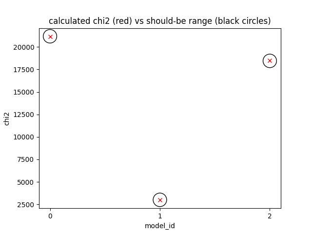

.. _installation:

******************
Installation guide
******************

.. _sys-requirements:

System requirements
===================

Computers running the DYNAMITE models must meet the following hardware requirements.

.. **Minimum Hardware Requirements**

.. * Processor:
.. * Processor speed:
.. * Random access memory (RAM):
.. * GPU
.. * Hard disk capacity:

**Recommended Hardware Requirements**

We recommend at least 50-100 GB of hard disk space for running the dynamical models. The DYNAMITE software only takes 150 MB, but the orbit libraries can become very large. As examples one model for the following orbit libraries has the size:

* (nE, nI2, nI3) = (5,4,3)    : 85 MB
* (nE, nI2, nI3) = (21,8,7)   : 664 MB
* (nE, nI2, nI3) = (41,11,11) : 2.55 GB

And usually, for one galaxy you will create at least 30 models to find the best-fitting model parameters.

.. _software-requirements:

Software requirements
=====================

Fortran compiler
----------------

The current version of DYNAMITE is based on routines which were written in Fortran. It is therefore necessary to have a pre-installed Fortran compiler. The best-suited Fortran compiler differs with different operation systems.

If you are using Linux, you will need ``ifort`` or ``gcc-gfortran``.

If you are using macOS, you will need ``gfortran``, which can be installed in a number of different ways.

**Important:** If you install the GCC package, do **not** install GCC 10 or higher as we noted  significant differences with this version.

macOS
^^^^^

In the following, we explain the installation of the GCC Fortran compiler via Homebrew and via MacPorts. **Homebrew** can be used to install the latest GCC and all additional libraries in the following way::

    brew update
    brew install gcc@9

We can check if gfortran is installed by typing in the Terminal::

    man -k fortran

with the output: ``gfortran(1) - GNU Fortran compiler``. The command ::

    which gfortran

returns its location, for example: ``/usr/local/bin/gfortran``.

Alternatively, you can also install GCC with **MacPorts**. The installation is then a bit different::

    sudo port selfupdate
    sudo upgrade outdated
    port search --name --line --glob 'gcc*'

lists the available GCC version. For example, having as the latest one gcc9, one should then proceed as follows::

    sudo port install gcc9
    sudo port select --set gcc mp-gcc9

to install it and make it the default version (including gfortran). Check and display the path with::

    gfortran -v
    ...
    which gfortran

which returns something like ``/opt/local/bin/gfortran``.

Python
------

The user is communicating with the Fortran source code via Python. The basic requirement for DYNAMITE is therefore a reasonably current version of Python (tested with Legacy Python 2.7, Python 3.6, Python 3.7, and Python 3.8).

.. Pre-Installation Checklist
.. --------------------------

Known problems
--------------

* Make sure that the compiler collection is installed with the proper libraries. If you get problems running Galahad or DYNAMITE, try to reinstall GCC and make sure that the Fortran compiler is included in your installation.

* Do not use GCC 10 or higher!

.. _install-procedure:

Installation and Configure Procedure
====================================

Download from `github <https://github.com/dynamics-of-stellar-systems/dynamite>`_, unzip and move the DYNAMITE code to the directory in which you want to install it. Make sure that your system fulfills the :ref:`software-requirements` listed above (in particular the Fortran compiler).

The installation of DYNAMITE consists of three steps, as detailed below.

1. Installation of GALAHAD
--------------------------

GALAHAD is a "library of thread-safe Fortran 90 packages for large-scale nonlinear optimization". The DYNAMITE code comes with Version 2.3.  An updated version of GALAHAD could be obtained `here <http://www.galahad.rl.ac.uk/doc.html>`_ (last updated in 2018), but the most recent version seems to not work. The GALAHAD package included in DYNAMITE can be found in the folder ``.../legacy_fortran``.

For the installation go into the folder ``.../legacy_fortran/galahad-2.3/`` and type ::

    ./install_galahad

In the following installation, a number of prompts start. The answers differ for the different operation system and are shown in the following.

During the installation, your terminal might express several warnings. These are however not critical if your installation finishes properly.

Install Galahad, Version 2.3 - Prompt answers for Linux
^^^^^^^^^^^^^^^^^^^^^^^^^^^^^^^^^^^^^^^^^^^^^^^^^^^^^^^

Prompts from ``./install_galahad``. The answers for the recommended installation are marked in bold.

**Select platform**

1. Compaq (DEC) alpha
2. Cray
3. HP Workstation
4. IBM RS/6000
5. **PC <--**
6. ...

**Select operating system**

1. Windows 2000/XP with MinGW/Msys
2. **Linux <--**

**Select compiler**

1. NAG f90
2. NAG f95
3. Intel Itanium efc under linux (pc version)
4. Fujitsu frt under linux (pc version)
5. GNU g95 under linux (pc version)
6. **GNU gfortran under linux (pc version) <--**
7. **Intel ifort (previously ifc) under linux (pc version) <--**
8. Lahey lf95 under linux (pc version)
9. Portland Group pgf90 under linux (pc version)

(Note: pick either ``gfortran`` or ``ifort`` depending on what you installed above)

**Select subset of GALAHAD packages to be installed (the chosen subset will optionally be installed below)**

1. Everything
2. Everything for SIF/CUTEr
3. Everything for AMPL
4. LANCELOT B and its interface to SIF
5. LANCELOT B and its interface to AMPL
6. Just LANCELOT B
7. **The QP packages and their interfaces to CUTEr <--**
8. The QP packages and their interfaces to AMPL
9. Just the QP packages and their dependencies
10. FILTRANE and its interface to CUTEr
11. FILTRANE and its interface to AMPL
12. Just FILTRANE and its dependencies

**By default, the CUTEr you wish to use is installed in ... Is this OK?**

* y(es)
* **n(o) <--**

**Enter alternative directory for CUTEr:**

  | ``/home/.../dynamite/legacy_fortran/cuter`` (Note: Put your full directory path here)

**Do you now wish to compile the package subset you selected earlier?**

* **y(es) <--**
* n(o)

**The package subset may be installed in either single or double precision. Which precision do you require for the installed subset?**

* **D for double precision <--**
* S for single precision

**Do you also wish to install the single precision version?**

* y(es)
* **n(o) <--**

Install Galahad, Version 2.3 - Prompt answers for macOS
^^^^^^^^^^^^^^^^^^^^^^^^^^^^^^^^^^^^^^^^^^^^^^^^^^^^^^^
Prompts from ``./install_galahad``. The answers for the recommended installation are marked in bold.

**Select platform**

1. Compaq (DEC) alpha
2. Cray
3. HP Workstation
4. IBM RS/6000
5. PC
6. PC with ..
7. PC with
8. PC with
9. SGI workstation
10. SUN workstation
11. **MAC OS/X <--**

**Select compiler**

When using MacOS:

1. NAG f90
2. NAG f95
3. AbSoft f95
4. GNU g95 under OS/X
5. **GNU gfortran under OS/X <--**
6. Intel ifort (previously ifc) under Mac OsX

**Select subset of GALAHAD packages to be installed (the chosen subset will optionally be installed below)**

1. Everything
2. Everything for SIF/CUTEr
3. Everything for AMPL
4. LANCELOT B and its interface to SIF
5. LANCELOT B and its interface to AMPL
6. Just LANCELOT B
7. **The QP packages and their interfaces to CUTEr <--**
8. ...

**By default, the CUTEr you wish to use is installed in ... Is this OK?**

* y(es)
* **n(o) <--**

**Enter alternative directory for CUTEr:**

  | ``/Users/.../dynamite/legacy_fortran/cuter`` (Note: Put your full directory path here)

**Do you now wish to compile the package subset you selected earlier?**

* **y(es) <--**
* n(o)

**The package subset may be installed in either single or double precision. Which precision do you require for the installed subset?**

* **D for double precision <--**
* S for single precision

**Do you also wish to install the single precision version?**

* y(es)
* **n(o) <--**

Finalizing the installation of GALAHAD
^^^^^^^^^^^^^^^^^^^^^^^^^^^^^^^^^^^^^^

Set environment variables and path as prompted at the end of successful Galahad installation e.g. in your .bashrc file.

**Example: GALAHAD environment variables**

Output from GALAHAD::

    Remember to set the environment variable
     GALAHAD to /home/.../legacy_fortran/galahad-2.3
    In addition, please update your MANPATH to include
       /home/.../legacy_fortran/galahad-2.3/man
    and your PATH to include
       /home/.../legacy_fortran/galahad-2.3/bin

Update in .bashrc::

    export GALAHAD="/home/.../legacy_fortran/galahad-2.3"
    export MANPATH="$MANPATH:/home/.../legacy_fortran/galahad-2.3/man"
    export PATH="$PATH:/home/.../legacy_fortran/galahad-2.3/bin"

2. Compiling the Fortran programs
----------------------------------

Go back to ``.../legacy_fortran``. Before you proceed, it is necessary to make the following three changes to the ``Makefile``:

* Change the local path of Galahad (``GALAHADDIR``) to the path of your GALAHAD variable in the .bashrc (something like ``/home/.../.../legacy_fortran/galahad-2.3``).
* Select the appropriate choice of ``GALAHADTYPE`` variable depending on your system (possible options are commented out)
* Look for the definition of the ``all:`` (this should be right after the definition of the ``GALAHADTYPE`` variable). Make sure that ``triaxgasnnls`` is **NOT** in the list.

If you install and run DYNAMITE on your own computer, there seems to be a memory allocation problem when building the orbit library. This problem has currently been tackled by adding a line in the source code (the line ``print*, t1,t2,t3`` right after ``losvel(:) = t1 * vel(:,1) + t2 * vel(:,2) + t3 * vel(:,3)`` in the subroutine ``project_n(type,pos,vel,proj,losvel,n)``). If you work in a cluster system, you can probably delete these lines (to speed up the code), but please do a careful check here!

Proceed with the following command from the terminal::

    make all

Your terminal will likely express several warnings again, but these are not critical and refer to different coding conventions in earlier Fortran versions. Now, take a look in the directory ``.../legacy_fortran`` and check that you have .f90 files and executables (no ending) for:

* modelgen
* orbitstart
* orblib
* partgen
* triaxmass
* triaxmassbin
* triaxnnls_CRcut

3. Installing DYNAMITE
----------------------

If all these files are there, you can proceed with the installation, by going back to ``.../dynamite`` and running::

    python setup.py install

To make uninstalling easier, it is useful to record the files which have been created when you install the package. This can be done by::

    python setup.py install --record list_of_created_files.txt

Several Python packages are installed in this way, including:

      * astropy
      * PyYAML
      * numpy
      * matplotlib
      * glob
      * os
      * shutil

DYNAMITE should now be installed and ready to be run! You can now try the examples proposed in :ref:`test-run`.

Uninstalling DYNAMITE from the system
-------------------------------------

To remove all compiled Fortran codes, go back to ``.../legacy_fortran``, and type the following command from the terminal::

    make distclean

If you used the ``--record`` option suggested above when installing the python part of the code, you can easily uninstall it by manually removing all the files listed in the text file.

..
    Post-Installation
    =================

    Post-installation checklist
    ---------------------------

    Congratulations! You have successfully installed DYNAMITE on your system!

.. _test-run:

Test runs
=========

LOSVD test run
--------------

As a first check, to make sure that everything is working in the correct way, you can carry out this simple and quick test. Go into the directory ``.../tests/``, and run::

    python test_orbit_losvds.py

This code takes about one minute to run.

You can check the output in the directory ``.../tests/NGC6278_output/plots``, where you should find a plot called ``orbit_losvds.png``, looking like the following figure.

.. image:: orbit_losvds.png

NNLS test run
-------------

To check that also the NNLS (Non-Negative Least Square) part of the code is also working without problems, you can run::

    python test_nnls.py

in the ``.../tests/`` directory, which takes less than two minutes to run.

You can check the output in the directory ``.../tests/NGC6278_output/plots``, where you should find a plot called ``chi2_vs_model_id.png``, looking like the following figure.

You should not worry if the red crosses in the image you obtain are slightly outside the black circles, the code is running correctly.

..
    NGC 6278 test run
    -----------------

    You can have a test run of the DYNAMITE code and the analysis scripts on the S0 galaxy NGC 6278. In the end you should get similar plots to the ones shown in `Zhu et al. 2018, MNRAS, 473, 3000 <https://arxiv.org/pdf/1709.06649.pdf>`_.
    For this test run, we have created a data directory in ``.../tests/NGC6278``, containing all the necessary data. This directory only includes the configuration file ``user_test_config.yaml`` and a folder ``input_data``, which contains the input files of the DYNAMITE code. If you run the code with your own data, make sure that your galaxy folder (named by the object name) has all input files with the parameters set properly for your galaxy.

    To run this test, go to the folder ``.../tests`` and start your model by typing in the terminal::

        python user_test

Troubleshooting
===============

* Do not use GCC 10 or higher!

(under construction...)
